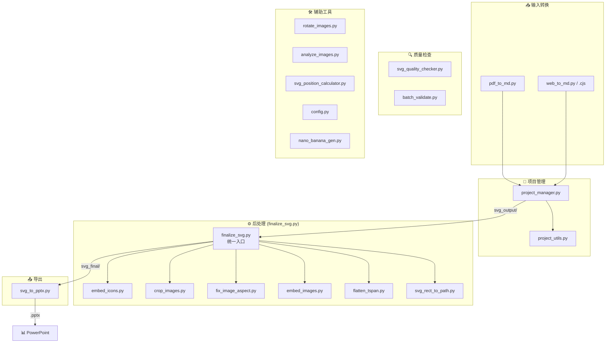

# PPT Master 工具集

本目录包含用于项目管理、验证和文件处理的实用工具。

## 工具架构总览



### 核心工作流

```
源文档 → [pdf_to_md / web_to_md] → Markdown
                    ↓
              [project_manager init]
                    ↓
              AI 生成 SVG → svg_output/
                    ↓
              [finalize_svg] ← 聚合 6 个子工具
                    ↓
              svg_final/
                    ↓
              [svg_to_pptx] → output.pptx
```

### 工具分类快速索引

| 分类 | 工具 | 说明 |
|------|------|------|
| **输入转换** | `pdf_to_md.py`, `web_to_md.py/.cjs` | 将 PDF/网页转为 Markdown |
| **项目管理** | `project_manager.py` | 创建、验证项目 |
| **后处理** | `finalize_svg.py` ⭐ | 统一入口，调用下方 6 个工具 |
| ↳ 子工具 | `embed_icons.py` | 嵌入图标占位符 |
| ↳ 子工具 | `crop_images.py` | 智能裁剪图片 |
| ↳ 子工具 | `fix_image_aspect.py` | 修复图片宽高比 |
| ↳ 子工具 | `embed_images.py` | Base64 嵌入图片 |
| ↳ 子工具 | `flatten_tspan.py` | 文本扁平化 |
| ↳ 子工具 | `svg_rect_to_path.py` | 圆角矩形转 Path |
| **导出** | `svg_to_pptx.py` | SVG 转 PowerPoint |
| **讲稿处理** | `total_md_split.py` | 讲稿拆分工具 |
| **质量检查** | `svg_quality_checker.py`, `batch_validate.py` | 验证 SVG 规范 |
| **素材生成** | `nano_banana_gen.py` | 利用 Gemini Nano 生成高品质图片 |
| **辅助** | `config.py`, `analyze_images.py`, `rotate_images.py` | 配置和图片处理 |

---

## 工具列表

### 0. pdf_to_md.py — PDF 转 Markdown 工具（推荐首选）

使用 PyMuPDF 将 PDF 文档转换为 Markdown 格式，本地运行、快速、免费。

**功能**:

- 提取 PDF 文本内容并转换为 Markdown
- 自动提取表格并转换为 Markdown 表格
- 自动提取图片并保存到 `images/` 目录
- 支持批量处理目录下的所有 PDF

**用法**:

```bash
# 转换单个文件
python3 tools/pdf_to_md.py book.pdf

# 指定输出文件
python3 tools/pdf_to_md.py book.pdf -o output.md

# 转换目录下所有 PDF
python3 tools/pdf_to_md.py ./pdfs

# 指定输出目录
python3 tools/pdf_to_md.py ./pdfs -o ./markdown
```

**何时使用 pdf_to_md.py vs MinerU**:

| 场景 | 推荐工具 | 原因 |
|------|----------|------|
| **原生 PDF**（Word/LaTeX 导出） | `pdf_to_md.py` | 本地、秒级、免费 |
| **简单表格** | `pdf_to_md.py` | 已支持表格提取 |
| **隐私敏感文档** | `pdf_to_md.py` | 数据不出本机 |
| **扫描版/图片 PDF** | MinerU | 需要 OCR |
| **复杂多栏排版** | MinerU | 版面分析更准 |
| **数学公式** | MinerU | AI 识别能力强 |
| **乱码 PDF**（编码丢失） | MinerU | 视觉识别兜底 |

> **策略**: PyMuPDF 优先，MinerU 兜底。先运行 `pdf_to_md.py`，如结果乱码/空白/排版错乱再换 MinerU。

**依赖**:

```bash
pip install PyMuPDF
```

---

### 0.5. web_to_md.py / web_to_md.cjs — 网页转 Markdown 工具

将网页内容抓取并转换为 Markdown 格式，自动下载图片到本地。

**注意**: 提供 Python 和 Node.js 两个版本。对于微信公众号等有 TLS 指纹拦截的站点，**强烈推荐使用 Node.js 版本** (`web_to_md.cjs`)。

**功能**:

- 抓取网页内容并转换为 Markdown
- 自动提取页面元数据（标题、日期、作者）
- 自动下载图片并保存到 `_files/` 目录
- **自动清理文件名**（仅保留中英文数字下划线，兼容性极佳）
- 智能识别主要内容区域（支持中文新闻/政府网站）
- 支持批量处理多个 URL

**用法 (Python)**:

```bash
# 转换单个网页
python3 tools/web_to_md.py https://example.com/article

# 转换多个网页
python3 tools/web_to_md.py https://url1.com https://url2.com

# 从文件批量读取 URL
python3 tools/web_to_md.py -f urls.txt

# 指定输出文件
python3 tools/web_to_md.py https://example.com -o output.md
```

**用法 (Node.js) — 推荐用于微信公众号**:

```bash
# 转换单个网页
node tools/web_to_md.cjs https://mp.weixin.qq.com/s/xxxx

# 转换多个网页
node tools/web_to_md.cjs https://url1.com https://url2.com

# 从文件批量读取 URL
node tools/web_to_md.cjs -f urls.txt
```

**输出结构**:

```
projects/
├── 文章标题.md           # Markdown 内容
└── 文章标题_files/       # 图片目录
    ├── image_1.jpg
    ├── image_2.png
    └── ...
```

**何时使用 web_to_md.py / .cjs**:

| 场景 | 推荐工具 | 原因 |
|------|----------|------|
| **微信公众号/高防站点** | `web_to_md.cjs` | Node.js 对 TLS 指纹拦截不仅更友好，且能大大降低被 403 的概率 |
| **普通新闻/文章类网页** | 任选其一 | 均可自动提取正文、下载图片 |
| **图文内容**（游记、攻略等） | 任选其一 | 保留图片资源 |
| **政府/机构网站** | `web_to_md.py` | Python 版对某些特定中文编码处理可能微优 |
| **需要登录的页面** | 手动处理 | 工具不支持认证 |
| **动态渲染页面（SPA）** | 手动处理 | 需要 headless browser |

> **策略**: 遇到 403 错误或微信文章时，请直接切换使用 `web_to_md.cjs`。

**依赖**:

Python:
```bash
pip install requests beautifulsoup4
```

Node.js:
(脚本使用原生模块，无需额外 npm install，但需 Node.js 环境)

---

### 0.6. rotate_images.py — 图片方向修正工具

处理从网页下载的图片 EXIF 方向信息丢失或错误的专用工具。

**功能**:

- **自动 EXIF 修正**: 识别并修复带有 EXIF Orientation 标签的图片
- **可视化旋转**: 生成 HTML 工具页面，点击即可旋转图片
- **自然排序**: 确保图片按文件名自然顺序排列
- **独立运行**: 不依赖爬虫脚本，可单独对任何目录使用

**用法**:

```bash
# 1. 自动修正（静默模式，仅修复 EXIF）
python3 tools/rotate_images.py auto projects/xxx_files

# 2. 生成可视化工具（先修复 EXIF，再生成网页）
python3 tools/rotate_images.py gen projects/xxx_files
# -> 生成 projects/image_orientation_tool.html，浏览器打开即可操作

# 3. 应用修正（根据网页生成的 JSON）
python3 tools/rotate_images.py fix fixes.json
```

---

### 1. project_utils.py — 项目工具公共模块

提供项目信息解析、验证等公共功能，供其他工具复用。

**功能**:

- 画布格式定义和管理
- 项目信息解析（从目录名提取格式、日期等）
- 项目结构验证
- SVG viewBox 验证
- 项目查找和统计

**用法**:

```bash
# 作为模块被其他工具导入
from project_utils import get_project_info, validate_project_structure

# 也可以直接运行测试
python3 tools/project_utils.py <project_path>
```

---

### 2. project_manager.py — 项目管理工具

项目初始化、验证和管理的一站式工具。

**功能**:

- 初始化新项目（创建标准目录结构）
- 验证项目完整性
- 查看项目信息

**用法**:

```bash
# 初始化新项目
python3 tools/project_manager.py init <project_name> --format ppt169

# 验证项目结构
python3 tools/project_manager.py validate <project_path>

# 查看项目信息
python3 tools/project_manager.py info <project_path>
```

**支持的画布格式**:

- `ppt169` - PPT 16:9 (1280×720)
- `ppt43` - PPT 4:3 (1024×768)
- `wechat` - 微信公众号头图 (900×383)
- `xiaohongshu` - 小红书 3:4 (1242×1660)
- `moments` - 朋友圈/Instagram 1:1 (1080×1080)
- `story` - Story/竖版 9:16 (1080×1920)
- `banner` - 横版 Banner 16:9 (1920×1080)
- `a4` - A4 打印 (1240×1754)

**示例**:

```bash
# 创建一个新的 PPT 16:9 项目
python3 tools/project_manager.py init my_presentation --format ppt169

# 验证项目
python3 tools/project_manager.py validate projects/my_presentation_ppt169_20251116

# 查看项目信息
python3 tools/project_manager.py info projects/my_presentation_ppt169_20251116
```

---

### 3. flatten_tspan.py — 文本扁平化（去 `<tspan>`）

> **推荐**: 使用 `finalize_svg.py` 作为统一入口，已集成文本扁平化功能。以下为独立使用的高级用法。

将含有多行 `<tspan>` 的 `<text>` 结构扁平化为多条独立的 `<text>` 元素，便于部分渲染器兼容或文本抽取。

**注意**: 生成端仍应使用 `<tspan>` 手动换行（禁用项详见 `AGENTS.md`）。此工具仅用于后处理。

**用法**:

```bash
# 扁平化整个输出目录
python3 tools/flatten_tspan.py examples/<project>/svg_output

# 处理单个 SVG
python3 tools/flatten_tspan.py path/to/input.svg path/to/output.svg
```

**行为说明**:

- 逐个 `<tspan>` 计算绝对位置（综合 `x`/`y` 与 `dx`/`dy`），合并父/子样式，输出为独立 `<text>`
- 复制父 `<text>` 的通用文本属性和 `style`，子级覆盖优先
- 保留或合并 `transform`
- 输出采用 UTF-8 编码，无 XML 声明

**已知限制**:

- 仅处理 `<text>`/`<tspan>` 结构；其他子元素不做转换
- 复杂嵌套或特殊布局请先在生成端简化为规范的逐行 `<tspan>`

---

### 4. batch_validate.py — 批量项目验证工具

一次性检查多个项目的结构完整性和规范性。

**功能**:

- 批量验证项目结构
- 检查必需文件（README、设计规范、SVG 等）
- 验证 SVG viewBox 设置
- 生成验证报告
- 提供修复建议

**用法**:

```bash
# 验证单个目录
python3 tools/batch_validate.py examples

# 验证多个目录
python3 tools/batch_validate.py examples projects

# 验证所有
python3 tools/batch_validate.py --all

# 导出报告
python3 tools/batch_validate.py examples --export
```

**示例输出**:

```
✅ google_annual_report_ppt169_20251116
   路径: examples/google_annual_report_ppt169_20251116
   格式: PPT 16:9 | SVG: 10 个 | 日期: 2025-11-16

⚠️  某项目名称
   路径: examples/某项目名称
   格式: PPT 16:9 | SVG: 8 个 | 日期: 2025-10-15
   ⚠️  警告 (1):
      - SVG 文件命名不规范: old_name.svg
```

---

### 5. generate_examples_index.py — Examples 索引生成工具

自动扫描 examples 目录并生成 README.md 索引文件。

**功能**:

- 自动发现所有示例项目
- 按格式分类整理
- 生成统计信息
- 创建预览链接
- 更新使用说明

**用法**:

```bash
# 生成 examples/README.md
python3 tools/generate_examples_index.py

# 指定目录
python3 tools/generate_examples_index.py examples
```

**特性**:

- 自动检测项目信息（名称、格式、日期、SVG 数量）
- 按画布格式分组
- 显示最近更新的项目
- 包含使用说明和贡献指南

---

### 6. error_helper.py — 错误消息助手

提供友好的错误消息和具体的修复建议。

**功能**:

- 标准化错误类型定义
- 提供具体的解决方案
- 支持上下文定制
- 格式化输出

**用法**:

```bash
# 查看所有错误类型
python3 tools/error_helper.py

# 查看特定错误的解决方案
python3 tools/error_helper.py missing_readme

# 带上下文
python3 tools/error_helper.py missing_readme project_path=my_project
```

**支持的错误类型**:

- `missing_readme` - 缺少 README.md
- `missing_spec` - 缺少设计规范
- `missing_svg_output` - 缺少 svg_output 目录
- `viewbox_mismatch` - viewBox 不匹配
- `foreignobject_detected` - 检测到禁用元素（详见 AGENTS.md 黑名单）
- 等等...

---

### 7. svg_quality_checker.py — SVG 质量检查工具

检查 SVG 文件是否符合项目技术规范。

**功能**:

- 验证 viewBox 属性
- 检测禁用元素（详见 AGENTS.md）
- 检查字体使用
- 验证 width/height 与 viewBox 一致性
- 检查文本换行方式

**用法**:

```bash
# 检查单个文件
python3 tools/svg_quality_checker.py examples/project/svg_output/01_cover.svg

# 检查整个目录
python3 tools/svg_quality_checker.py examples/project/svg_output

# 检查项目（自动查找 svg_output）
python3 tools/svg_quality_checker.py examples/project

# 指定期望格式
python3 tools/svg_quality_checker.py examples/project --format ppt169

# 检查所有项目
python3 tools/svg_quality_checker.py --all examples

# 导出报告
python3 tools/svg_quality_checker.py examples/project --export
```

**检查项目**:

- ✅ viewBox 属性存在且格式正确
- ✅ 无禁用元素（详见 AGENTS.md）
- ✅ 使用《设计规范》指定的字体
- ✅ width/height 与 viewBox 一致
- ✅ 文本使用 `<tspan>` 换行

---

### PPT 兼容性规则

为确保导出 PPT 后效果一致，**透明度必须使用标准写法**：

| ❌ 禁止 | ✅ 正确 |
|--------|--------|
| `fill="rgba(255,255,255,0.1)"` | `fill="#FFFFFF" fill-opacity="0.1"` |
| `<g opacity="0.2">...</g>` | 每个子元素单独设置透明度 |
| `<image opacity="0.3"/>` | 图片后加遮罩层 `<rect fill="背景色" opacity="0.7"/>` |

> 📌 **记忆口诀**：PPT 不认 rgba、不认组透明、不认图片透明、不认 marker

---

### 8. svg_to_pptx.py — SVG 转 PPTX 工具

将项目中的 SVG 文件批量转换为 PowerPoint 演示文稿，保留矢量图形的可编辑性。

**功能**:

- 批量将 SVG 转换为 PPTX
- 每个 SVG 对应一张幻灯片
- 自动检测画布格式并设置幻灯片尺寸
- 支持使用 svg_output 或 svg_final 目录
- SVG 在 PowerPoint 中保持可编辑
- **支持页面切换动画和入场动画**
- **自动嵌入演讲备注**（从 notes/ 目录读取）

**用法**:

```bash
# 推荐：使用后处理完成的版本（默认嵌入备注）
python3 tools/svg_to_pptx.py <项目路径> -s final

# 禁用演讲备注
python3 tools/svg_to_pptx.py <项目路径> -s final --no-notes

# 使用原始版本
python3 tools/svg_to_pptx.py <项目路径>

# 指定输出文件
python3 tools/svg_to_pptx.py <项目路径> -s final -o output.pptx

# 添加页面切换效果
python3 tools/svg_to_pptx.py <项目路径> -t fade --transition-duration 1.0

# 静默模式
python3 tools/svg_to_pptx.py <项目路径> -s final -q
```

**演讲备注**:

工具自动读取 `notes/` 目录中的 Markdown 备注文件，并嵌入到 PPTX 的演讲者备注中。

**文件命名支持两种方式**：
- **推荐**：与 SVG 同名（如 `01_封面.svg` 对应 `notes/01_封面.md`）
- **兼容**：`slide01.md` 格式（向后兼容）

| 参数 | 说明 |
|------|------|
| 默认 | 自动嵌入备注（无备注文件则留空） |
| `--no-notes` | 禁用备注嵌入 |

**切换效果参数**:

| 参数 | 说明 | 可选值 |
|------|------|--------|
| `-t`, `--transition` | 页面切换效果 | fade, push, wipe, split, reveal, cover, random |
| `--transition-duration` | 切换持续时间（秒，默认 0.5） | 任意正数 |
| `--auto-advance` | 自动翻页间隔（秒） | 任意正数 |

**切换效果说明**:

| 效果 | 说明 |
|------|------|
| fade | 淡入淡出 |
| push | 推入 |
| wipe | 擦除 |
| split | 分割 |
| reveal | 揭示 |
| cover | 覆盖 |
| random | 随机 |

**SVG 来源目录 (`-s`)**:

| 参数 | 目录 | 说明 |
|------|------|------|
| `-s output` | `svg_output/` | 原始版本 |
| `-s final` | `svg_final/` | 后处理完成（推荐） |
| `-s <任意名>` | `<任意名>/` | 直接指定子目录 |

**示例**:

```bash
# 推荐流程：先后处理，再导出（带切换效果）
python3 tools/finalize_svg.py examples/ppt169_demo
python3 tools/svg_to_pptx.py examples/ppt169_demo -s final -t fade

# 自动播放演示（3秒切换）
python3 tools/svg_to_pptx.py examples/ppt169_demo -s final -t fade --auto-advance 3
```

**依赖**:

```bash
pip install python-pptx
```

**注意**:

- SVG 以原生矢量格式嵌入，保持可编辑性
- 需要 PowerPoint 2016+ 才能正确显示
- 文件体积比 PNG 方案小很多
- 切换效果默认关闭，需要用户显式启用
- 演讲备注默认开启，使用 `--no-notes` 禁用

---

### 9. total_md_split.py — 讲稿拆分工具

将 `total.md` 讲稿文件拆分为多个独立的讲稿文件，每个文件对应一个 SVG 页面。

**功能**:

- 读取 `total.md` 文件，解析其中的一级标题和讲稿内容
- 检查 `svg_output` 文件夹中的 SVG 文件是否都有对应的讲稿
- 如果存在 SVG 没有对应的讲稿，会输出错误提示要求重新生成讲稿文件
- 如果全部匹配，根据名称对文档进行拆分，分成多个文档
- 拆分后的文档命名与 SVG 文件同名，后缀改为 `.md`
- 拆分后的文档**不包含**一级标题

**用法**:

```bash
# 基本用法
python3 tools/total_md_split.py <项目路径>

# 指定输出目录
python3 tools/total_md_split.py <项目路径> -o <输出目录>

# 静默模式
python3 tools/total_md_split.py <项目路径> -q
```

**示例**:

```bash
# 基本用法
python3 tools/total_md_split.py projects/<svg 标题>_ppt169_YYYYMMDD

# 指定输出目录
python3 tools/total_md_split.py projects/<svg 标题>_ppt169_YYYYMMDD -o notes

# 静默模式
python3 tools/total_md_split.py projects/<svg 标题>_ppt169_YYYYMMDD -q
```

**讲稿格式要求**:

`total.md` 文件需要使用以下格式：

```markdown
# 01_<页面标题>

讲稿内容...

---

# 02_<页面标题>

讲稿内容...

---

# 03_<页面名称>

讲稿内容...
```

- 每个章节以 `# ` 开头的一级标题开始（**严格要求**）
- 标题文本需与对应 SVG 文件名一致（**严格要求**）
- 章节之间必须用 `---` 分隔（**严格要求**）
- 讲稿内容在标题之后，直到下一个标题或文件结束

**容错说明（工具侧）**：
即便未完全符合上述格式，`total_md_split.py` 仍会尝试根据标题/页码/名称相似度进行拆分，但结果不保证正确。请以严格格式为准。

**错误处理**:

如果存在 SVG 文件没有对应的讲稿，工具会输出错误信息：

```
错误: SVG 文件与讲稿不匹配
  缺失的讲稿: <N>_<页面标题>

请重新生成讲稿文件，确保每个 SVG 都有对应的讲稿。
```

**依赖**:

- Python 3.6+
- 无外部依赖（仅使用标准库）

---

### 10. svg_position_calculator.py — SVG 位置计算与验证工具

图表坐标的**事前计算**和**事后验证**工具，帮助确保 SVG 元素位置准确无误。

#### 核心功能

| 功能 | 说明 |
|------|------|
| **analyze** | 分析 SVG 文件，提取所有图形元素的坐标信息 |
| **calc** | 根据数据计算期望的图表坐标 |
| **interactive** | 交互式引导计算（推荐新手使用） |
| **from-json** | 从 JSON 配置文件批量计算 |
| **validate** | 验证 SVG 坐标与期望值的偏差 |

#### 支持的图表类型

| 类型 | 计算内容 | 输出 |
|------|----------|------|
| **柱状图 (bar)** | 柱子 X/Y/宽/高、标签位置 | 坐标表格 |
| **饼图 (pie)** | 扇区角度、弧线端点、标签位置 | 坐标表格 + Path d 属性 |
| **雷达图 (radar)** | 多边形顶点、标签位置 | 坐标表格 + polygon points |
| **折线图 (line)** | 数据点 SVG 坐标 | 坐标表格 + Path d 属性 |
| **网格布局 (grid)** | 单元格位置和尺寸 | 坐标表格 |
| **自定义折线** | 任意公式计算 | 坐标表格 + polyline points |

---

#### 命令详解

##### 1. analyze — 分析 SVG 文件

提取 SVG 中所有图形元素的位置信息，用于验证或调试。

```bash
python3 tools/svg_position_calculator.py analyze <svg文件>
```

**输出示例**:

```
======================================================================
SVG 文件分析: slide_03_chart.svg
======================================================================
画布 viewBox: 0 0 1920 1200

元素统计:
  - rect 矩形: 18 个
  - circle 圆形: 7 个
  - polyline/polygon: 1 个
  - path 路径: 2 个

=== 矩形元素 (rect) ===
序号    X         Y         宽度        高度
1     0         0         1920      130
2     190       285       200       530
...

=== 折线/多边形 (polyline/polygon) ===
折线 1 (39 个点):
  起始点: (210,431) → (250,425) → (290,433) → (330,377) → (370,517)
  ... 共 39 个点
```

##### 2. calc — 快速计算坐标

根据数据快速计算图表元素的期望坐标。

**柱状图**:

```bash
python3 tools/svg_position_calculator.py calc bar \
    --data "华东:185,华南:142,华北:128" \
    --canvas ppt169 \
    --bar-width 50
```

输出:
```
=== 柱状图坐标计算 ===
画布: 1280×720
图表区域: (140, 150) - (1160, 600)

序号  标签          数值      X        Y        宽度     高度
----  ----------  --------  -------  -------  -------  -------
   1  华东             185.0    560.0    190.9     50.0    409.1
   2  华南             142.0    625.0    286.0     50.0    314.0
   3  华北             128.0    690.0    317.0     50.0    283.0
```

**饼图**:

```bash
python3 tools/svg_position_calculator.py calc pie \
    --data "A:35,B:25,C:20,D:12,其他:8" \
    --center 420,400 \
    --radius 200 \
    --start-angle -90
```

输出:
```
=== 饼图扇区计算 ===
圆心: (420, 400) | 半径: 200

序号  标签          百分比    起始角    终止角    标签X    标签Y
----  ----------  --------  --------  --------  -------  -------
   1  A              35.0%     -90.0     36.0     476.0    296.2
   2  B              25.0%      36.0    126.0     508.3    443.8
...

=== Path d 属性 ===
1. A: M 0,0 L 0.00,-200.00 A 200,200 0 0,1 161.80,-117.56 Z
2. B: M 0,0 L 161.80,-117.56 A 200,200 0 0,1 117.56,161.80 Z
...
```

**雷达图**:

```bash
python3 tools/svg_position_calculator.py calc radar \
    --data "性能:90,安全:85,易用:75,价格:70,服务:80" \
    --center 640,400 \
    --radius 200
```

**折线图**:

```bash
python3 tools/svg_position_calculator.py calc line \
    --data "0:50,10:80,20:120,30:95" \
    --canvas ppt169 \
    --y-range "0,150"
```

**网格布局**:

```bash
python3 tools/svg_position_calculator.py calc grid \
    --rows 2 --cols 3 \
    --canvas ppt169 \
    --padding 20 --gap 20
```

##### 3. interactive — 交互式模式

适合不熟悉命令行参数的用户，通过菜单引导完成计算。

```bash
python3 tools/svg_position_calculator.py interactive
```

菜单选项:
```
选择图表类型:
  1. 柱状图 (bar)
  2. 饼图 (pie)
  3. 雷达图 (radar)
  4. 折线图 (line)
  5. 网格布局 (grid)
  6. 自定义折线 (custom)    ← 支持自定义公式
  0. 退出
```

**自定义折线（选项 6）** 特别适用于价格指数图等需要自定义坐标公式的场景:

```
=== 自定义折线计算 ===
X起始值 [170]: 210
X步长 [40]: 40
Y基准值 [595]: 595
Y缩放系数 [20]: 20
参考基准值 [100]: 100

公式: X = 210 + 序号 × 40
      Y = 595 - (数值 - 100) × 20

输入数据: 108.2,108.5,108.1,110.9,103.9,97.0

序号    数值        X         Y
----  ----------  --------  --------
1     108.2       250       431
2     108.5       290       425
3     108.1       330       433
4     110.9       370       377
5     103.9       410       517
6     97.0        450       655

polyline points:
250,431 290,425 330,433 370,377 410,517 450,655
```

##### 4. from-json — JSON 配置批量计算

从 JSON 文件读取配置进行计算，适合批量处理或保存常用配置。

```bash
python3 tools/svg_position_calculator.py from-json config.json
```

**JSON 配置示例**:

柱状图配置:
```json
{
    "type": "bar",
    "canvas": "ppt169",
    "data": {
        "华东": 185,
        "华南": 142,
        "华北": 128
    }
}
```

自定义折线配置:
```json
{
    "type": "custom_line",
    "base_x": 210,
    "step_x": 40,
    "base_y": 595,
    "scale_y": 20,
    "ref_value": 100,
    "values": [108.2, 108.5, 108.1, 110.9, 103.9, 97.0]
}
```

---

#### 典型验证工作流

当 AI 生成 SVG 图表后，可以使用此工具验证坐标准确性：

1. **分析 SVG 文件**，提取实际坐标:
   ```bash
   python3 tools/svg_position_calculator.py analyze slide.svg
   ```

2. **根据原始数据计算期望坐标**（使用 calc 或 interactive）

3. **对比期望坐标与实际坐标**，检查偏差

4. **如有偏差，修正 SVG 文件**

**示例：验证价格指数折线图**

```bash
# 1. 分析 SVG，查看 polyline points
python3 tools/svg_position_calculator.py analyze slide_03_trend.svg

# 2. 使用交互模式计算期望坐标（选择 6. 自定义折线）
python3 tools/svg_position_calculator.py interactive

# 3. 对比输出的 polyline points 与 SVG 中的实际值
```

---

#### 坐标计算公式参考

**柱状图**:
```
bar_x = chart_area.x_min + (chart_area.width - total_bars_width) / 2 + i * (bar_width + gap)
bar_y = chart_area.y_max - (value / max_value) * chart_area.height
bar_height = (value / max_value) * chart_area.height
```

**饼图弧线端点**:
```
angle_rad = angle_degrees × π / 180
end_x = radius × cos(angle_rad)
end_y = radius × sin(angle_rad)
```

**折线图（自定义公式）**:
```
X = base_x + index × step_x
Y = base_y - (value - ref_value) × scale_y
```

---

#### 常见问题

**Q: 输出中文乱码怎么办？**

A: 工具已自动处理 Windows 下的 UTF-8 编码问题。如仍有问题，请确保终端设置为 UTF-8:
```bash
chcp 65001
```

**Q: 如何验证复杂图表？**

A: 对于复杂图表（如多系列柱状图），建议：
1. 先用 `analyze` 提取所有元素
2. 根据图表逻辑手动计算期望值
3. 逐一对比验证

**Q: 支持哪些画布格式？**

A: 支持 `ppt169`、`ppt43`、`xiaohongshu`、`moments` 等，详见 `project_utils.py` 中的 `CANVAS_FORMATS`。

---

### 11. svg_rect_to_path.py — SVG 圆角矩形转 Path 工具

解决 SVG 在 PowerPoint 中「转换为形状」时圆角丢失的问题。

**问题**: PowerPoint 不能正确解析 `<rect>` 的 `rx`/`ry` 圆角属性

**解决方案**: 将 `<rect rx="12" ry="12">` 转换为等效的 `<path d="...圆弧...">`

**用法**:

```bash
# 处理项目中的 SVG（默认使用 svg_output）
python3 tools/svg_rect_to_path.py <项目路径>

# 指定 SVG 来源目录
python3 tools/svg_rect_to_path.py <项目路径> -s final

# 指定输出目录名
python3 tools/svg_rect_to_path.py <项目路径> -o svg_for_ppt

# 处理单个文件
python3 tools/svg_rect_to_path.py path/to/file.svg

# 详细输出
python3 tools/svg_rect_to_path.py <项目路径> -v
```

**示例**:

```bash
# 处理项目
python3 tools/svg_rect_to_path.py examples/ppt169_demo
# 输出到: examples/ppt169_demo/svg_rounded/

# 处理单个文件
python3 tools/svg_rect_to_path.py examples/ppt169_demo/svg_output/01_cover.svg
# 输出到: examples/ppt169_demo/svg_output/01_cover_rounded.svg
```

**使用场景**:

当你需要在 PowerPoint 中将 SVG「转换为形状」进行编辑时，先用此工具预处理 SVG，可以保留圆角效果。

**注意**:

- 如果只是嵌入 SVG 而不转换为形状，无需使用此工具
- 透明度在「转换为形状」后仍会丢失（PowerPoint 限制）

---

### 12. fix_image_aspect.py — SVG 图片宽高比修复工具

解决 SVG 中 `<image>` 元素在 PowerPoint「转换为形状」时图片拉伸变形的问题。

**问题**: PowerPoint 在将 SVG 转换为可编辑形状时，会忽略 `preserveAspectRatio` 属性，导致图片被拉伸以填满指定的 width/height 区域。

**解决方案**: 
1. 读取图片的原始宽高比
2. 根据 `preserveAspectRatio` 模式（meet/slice）计算正确的 x, y, width, height
3. 移除 `preserveAspectRatio` 属性，用精确计算的尺寸替代

**用法**:

```bash
# 处理单个 SVG 文件
python3 tools/fix_image_aspect.py path/to/slide.svg

# 处理多个文件
python3 tools/fix_image_aspect.py 01_cover.svg 02_toc.svg 03_content.svg

# 预览模式（不修改文件）
python3 tools/fix_image_aspect.py --dry-run path/to/slide.svg

# 通过 finalize_svg.py 自动处理（推荐）
python3 tools/finalize_svg.py <项目路径>
```

**依赖**:

```bash
pip install Pillow  # 用于读取图片尺寸（推荐安装）
```

> **注意**: 如果没有安装 Pillow，工具会尝试用基本方法读取 PNG/JPEG 的头信息，但建议安装以获得更好的兼容性。

**使用场景**:

当你需要在 PowerPoint 中将 SVG「转换为形状」进行编辑，且 SVG 中包含图片时，使用此工具可以防止图片拉伸变形。

**已集成到 finalize_svg.py**:

此工具已作为 `finalize_svg.py` 的处理步骤之一（`fix-aspect`），默认自动执行。

---

### 13. gemini_watermark_remover.py — Gemini 水印去除工具

去除 Gemini 生成图片右下角的水印 Logo。使用逆向混合算法还原原始像素。

**功能**:

- 自动检测水印尺寸（大图 96px，小图 48px）
- 支持 PNG、JPG、JPEG 格式
- 使用逆向混合算法精确还原原始像素
- 输出文件默认添加 `_unwatermarked` 后缀

**用法**:

```bash
# 处理单张图片
python3 tools/gemini_watermark_remover.py <图片路径>

# 指定输出文件
python3 tools/gemini_watermark_remover.py <图片路径> -o 输出路径.png

# 静默模式
python3 tools/gemini_watermark_remover.py <图片路径> -q
```

**示例**:

```bash
# 处理 Gemini 生成的图片
python3 tools/gemini_watermark_remover.py projects/demo/images/bg_01.png

# 指定输出路径
python3 tools/gemini_watermark_remover.py image.jpg -o image_clean.jpg
```

**水印检测规则**:

| 图片尺寸 | 水印尺寸 | 边距 |
|----------|----------|------|
| > 1024×1024 | 96×96 | 64px |
| ≤ 1024×1024 | 48×48 | 32px |

**依赖**:

```bash
pip install Pillow numpy
```

**注意**:

- 此工具需要 `tools/assets/` 目录下的 `bg_48.png` 和 `bg_96.png` 水印背景图
- 处理后的图片会在原位置生成，添加 `_unwatermarked` 后缀

---

### 14. nano_banana_gen.py — Nano Banana 图像生成工具

利用 Google GenAI API 调用 Gemini 模型生成高质量图片素材。

**功能**:

- **高分辨率**: 支持最高 4K 分辨率生成
- **自定义宽高比**: 支持 `16:9`, `4:3`, `1:1`, `9:16` 等主流比例
- **提示词工程**: 内置负面提示词支持，自动优化生成质量
- **自动保存**: 自动根据提示词命名并保存为 PNG 格式

**用法**:

```bash
# 生成默认图片
python3 tools/nano_banana_gen.py "A modern futuristic workspace"

# 指定宽高比和尺寸
python3 tools/nano_banana_gen.py "Abstract tech background" --aspect_ratio 16:9 --image_size 4K

# 指定输出目录
python3 tools/nano_banana_gen.py "Concept car" -o projects/demo/images

# 使用负面提示词
python3 tools/nano_banana_gen.py "Beautiful landscape" -n "low quality, blurry, watermark"
```

**参数说明**:

| 参数 | 缩写 | 默认值 | 可选值 |
|------|------|--------|--------|
| `prompt` | - | Nano Banana | 提示词字符串 |
| `--negative_prompt` | `-n` | None | 负面提示词 |
| `--aspect_ratio` | - | `1:1` | `1:1`, `16:9`, `4:3`, `3:2`, `9:16`, `21:9` 等 |
| `--image_size` | - | `4K` | `1K`, `2K`, `4K` |
| `--output` | `-o` | 当前工作目录 | 图片保存目录 |

**环境变量配置**:

使用前需设置环境变量：

```bash
# 必需：Gemini API Key
export GEMINI_API_KEY="YOUR_GEMINI_API_KEY"

# 可选：自定义 API 端点（用于代理服务）
export GEMINI_BASE_URL="YOUR_API_BASE_URL"
```

> 💡 **提示**: 可将环境变量添加到 `~/.zshrc` 或 `~/.bashrc` 中永久生效。

**依赖**:

```bash
pip install google-genai
```

---

### 15. embed_icons.py — SVG 图标嵌入工具

将 SVG 文件中的图标占位符 (`<use ...>`) 替换为实际的图标路径数据，实现图标的“零依赖”嵌入。

**功能**:

- 扫描 `<use data-icon="...">` 占位符
- 从图标库（默认 `templates/icons/`）读取对应 SVG 图标
- 嵌入为 `<g>` 组并应用位置、大小和颜色
- 支持批量处理

**用法**:

```bash
# 处理单个文件
python3 tools/embed_icons.py output.svg

# 处理整个目录
python3 tools/embed_icons.py svg_output/*.svg

# 预览模式
python3 tools/embed_icons.py --dry-run svg_output/*.svg
```

---

## 工作流集成

### 典型工作流程

1. **创建新项目**

   ```bash
   python3 tools/project_manager.py init my_project --format ppt169
   ```

2. **编辑设计规范**
   编辑生成的 `设计规范与内容大纲.md` 文件

3. **生成 SVG 文件**
   使用 AI 角色（Strategist → Executor → Optimizer）生成 SVG 并保存到 `svg_output/`

4. **后处理（默认执行全部）**

   ```bash
   # 直接运行，无需参数
   python3 tools/finalize_svg.py projects/my_project_ppt169_20251116
   ```

5. **导出为 PPTX**

   ```bash
   python3 tools/svg_to_pptx.py projects/my_project_ppt169_20251116 -s final
   ```

6. **（可选）验证项目**

   ```bash
   python3 tools/project_manager.py validate projects/my_project_ppt169_20251116
   ```

### 批量操作

**批量验证项目**:

```bash
# 验证所有示例项目
python3 tools/batch_validate.py examples

# 验证并导出报告
python3 tools/batch_validate.py examples --export
```

**批量检查 SVG 质量**:

```bash
# 检查所有示例项目的 SVG
python3 tools/svg_quality_checker.py --all examples

# 导出质量报告
python3 tools/svg_quality_checker.py --all examples --export
```

## 依赖要求

大部分工具使用 Python 3 标准库，无需额外依赖。

**最低 Python 版本**: Python 3.6+

**可选依赖**:

- `python-pptx` — SVG 转 PPTX 功能需要
- `Pillow` — 图片宽高比修复、水印去除功能需要
- `numpy` — 水印去除功能需要

安装依赖：

```bash
pip install -r requirements.txt
# 或单独安装
pip install python-pptx
```

## 故障排除

### 问题：项目验证失败

**解决方案**:

1. 运行 `python3 tools/project_manager.py validate <path>` 查看详细错误
2. 根据错误提示修复缺失的文件或目录
3. 参考 `projects/README.md` 了解标准结构

### 问题：SVG 预览显示不正常

**解决方案**:

1. 确保 SVG 文件路径正确
2. 检查 SVG 文件命名是否符合规范（`slide_XX_name.svg`）
3. 使用本地服务器预览：`python3 -m http.server --directory <svg_output_path> 8000`

## 相关文档

- [工作流教程](../docs/workflow_tutorial.md)
- [快速参考](../docs/quick_reference.md)
- [AGENTS 指南](../AGENTS.md)

---

_最后更新: 2026-02-03_

_nano_banana_gen.py 文档更新: 2026-02-03_

_gemini_watermark_remover.py 文档更新: 2025-12-20_
